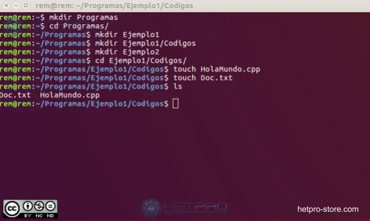

# 🏠 Bienvenido a Comandos básicos de Linux

Esta documentación está diseñada para guiarte a través de los comandos fundamentales de Linux para la navegación, manipulación de archivos, gestión de procesos y más.

## 🚀 Empecemos
Usa el menú de la izquierda (Sección 1, Sección 2) para empezar a explorar los temas.

---

### 📁 Ejemplo de Entorno

Aquí tienes un ejemplo visual de un entorno de terminal.

